---
# Only set deck-specific overrides here. Theme, transition, etc. come from preamble.yaml.
---

## How I bypassed my ISP's network limit {.incremental}

- Monthly data: gone
- Internet: dead
- But somehow… I could still ping my server 👀

## What is ICMP? {.incremental}

- Internet Control Message Protocol


## The ISO OSI Model

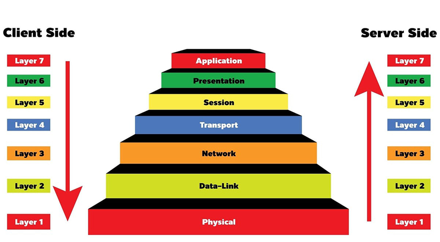

## ISO OSI Detail

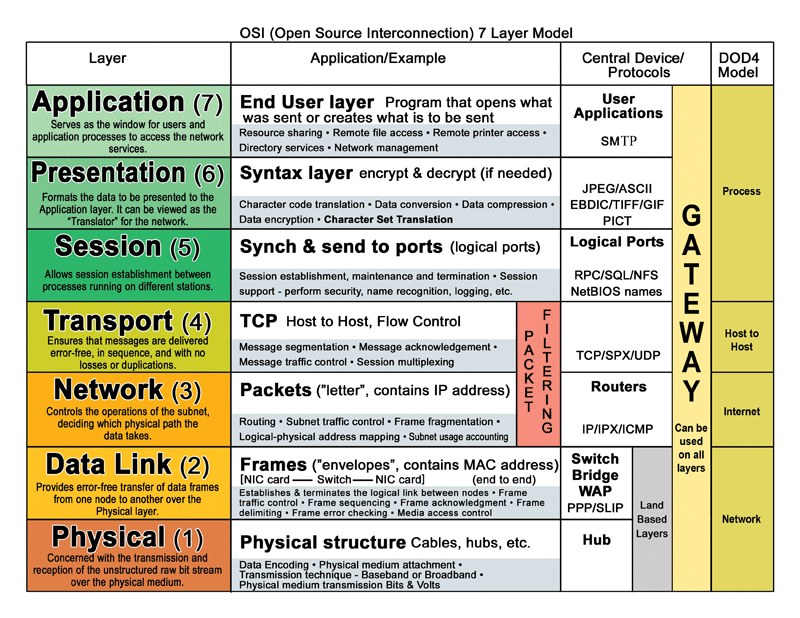

## What is Encapsulation?

<div style="display: flex; justify-content: space-between; align-items: center; gap: 1em;">
  <div style="flex: 1; text-align: center;">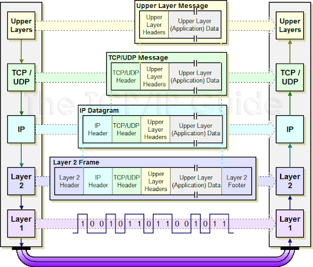</div>
  <div style="flex: 1; text-align: center;">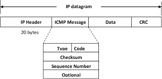</div>
</div>

## What is a Tunnel?

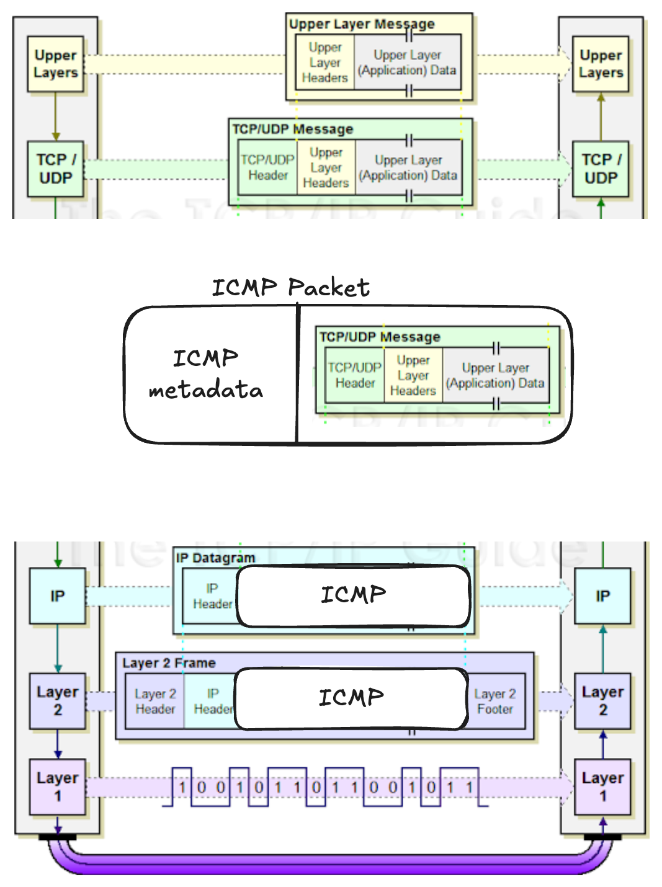

## Fun fact

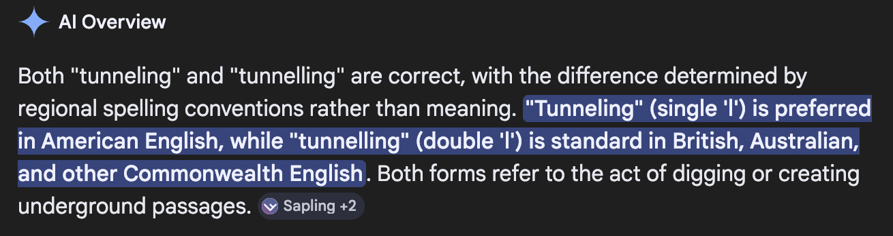

## Let's build it! {.small}

```c
#include <sys/socket.h> // Socket API
#include <netinet/in.h> // IP socket structures
#include <arpa/inet.h> // Address conversion utilities
#include <netdb.h> // Hostname resolution
```

::: fragment
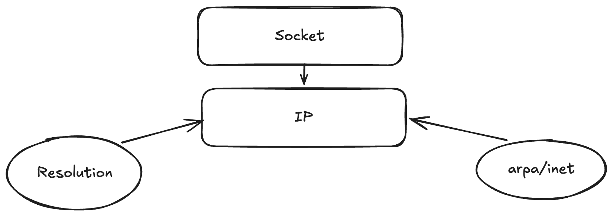
:::

## Notes before execution

- Run `sudo sysctl -w net.ipv4.icmp_echo_ignore_all=1`
- It only works on Linux

## Why did it work?

::: fragment
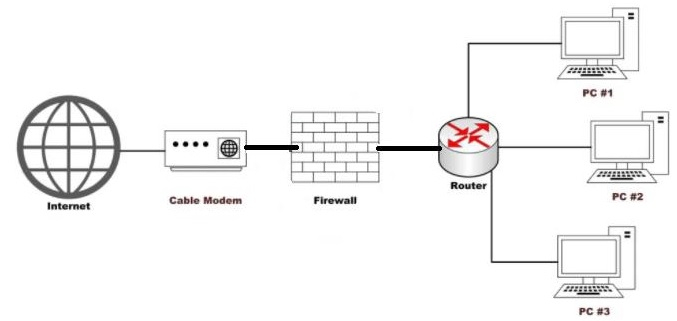
:::

## Nobody cares about ICMP

<div style="display: flex; justify-content: space-between; align-items: center; gap: 1em;">
  <div style="flex: 1; text-align: center;">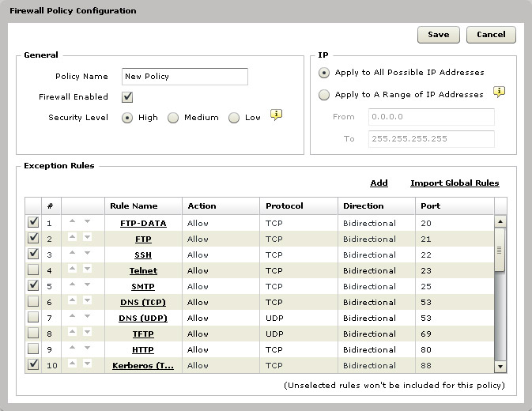</div>
  <div style="flex: 1; text-align: center;">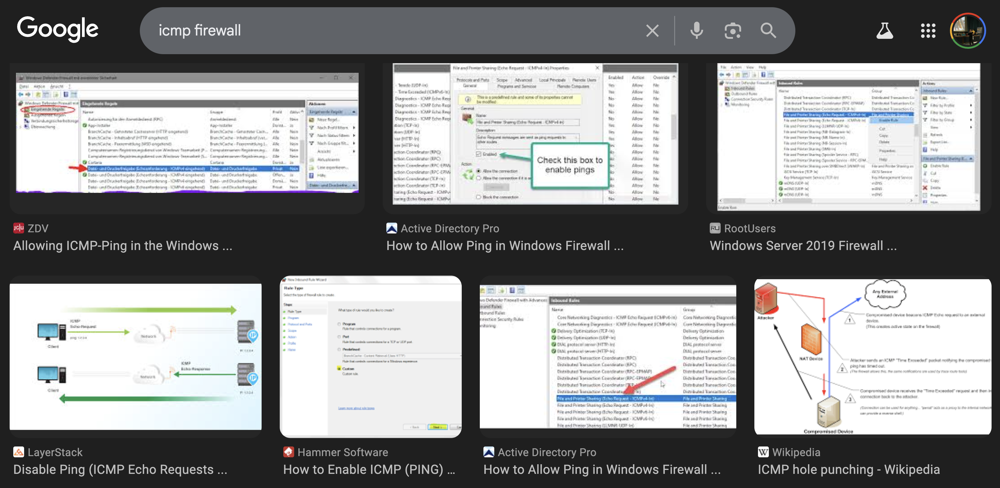</div>
</div>

## What to do now?

Report the vulnerability **immediately**!

## Are there other similar exploits?

- Sometimes they forget to fully block Layer 7
    - [https://github.com/yarrick/iodine](https://github.com/yarrick/iodine)
    - [https://github.com/sshuttle/sshuttle](https://github.com/sshuttle/sshuttle)
    - HTTP header tunneling
- [https://github.com/DhavalKapil/icmptunnel](https://github.com/DhavalKapil/icmptunnel)

## HTTP header tunneling

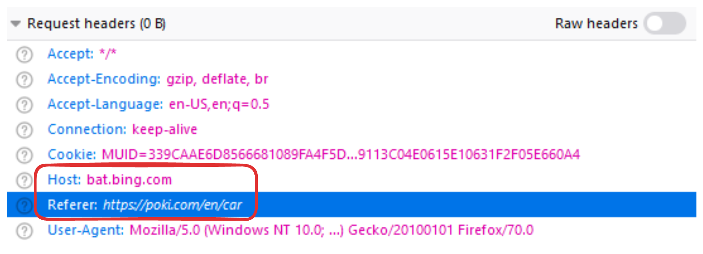

## Let's connect!

